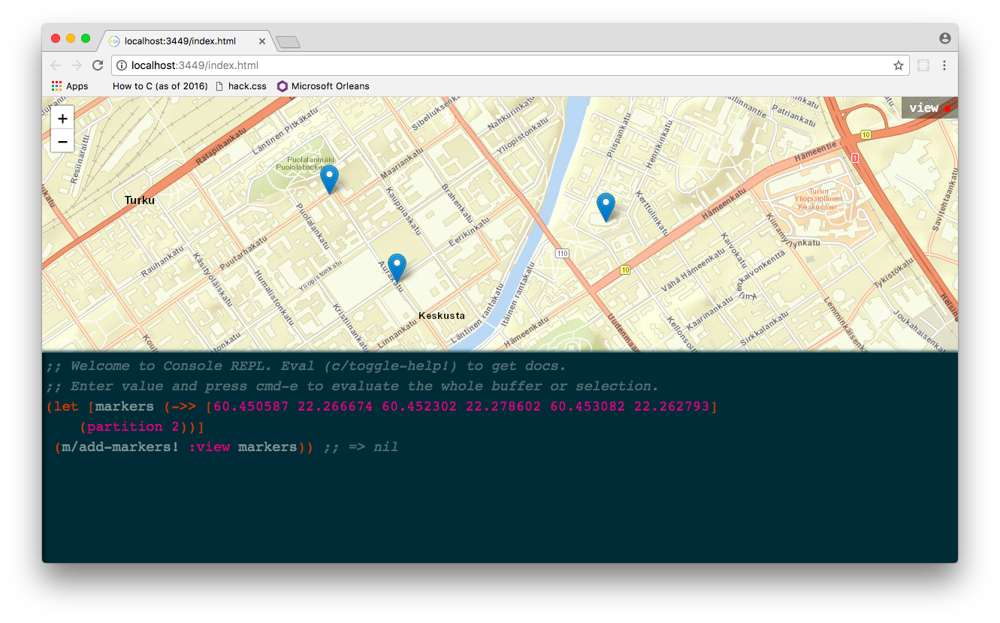

# Lab

Starting point for a CLJS based "printf on steroids" supporting displaying data in a map,
a C3 graph (line, bar chart), ja vis.js network or plain text based console output. It
also hosts support for connecting into realtime data sources with websocket.

## Keyboard shortcuts

| Keyboard shortcut |                                            Description                                           |
|-------------------|:------------------------------------------------------------------------------------------------:|
| Cmd-E             | Evaluate expression in current cursor position. Show result in HUD.                              |
| Cmd-Shift-E       | Evaluate topmost expression in current cursor position. Show result in HUD.                      |
| Cmd-R             | Evaluate expression in current cursor position. Append result to the next row in editor.         |
| Cmd-Shift-R       | Evaluate topmost expression in current cursor position. Append result to the next row in editor. |
| Cmd-Shift-L       | Evaluate the whole editor content form by form.                                                  |
| Cmd-Shift-T       | Toggle help.                                                                                     |
| Control-Space     | Get autosuggestions of built in functions and currently available view name keywords.            |
| Cmd-Shift-F       | Toggle Full REPL view.                                                                           |
| Cmd-H             | Toggle REPL visibility.                                                                          |
| Cmd-(Shift)-Y     | Make REPL bigger / smaller                                                                       |
| Cmd-J             | Declare var from pasted content                                                                  |

## Sessions

You can list sessions using `(lab.core/list-sessions!)`, load sessions with `(lab.core/load-session! <session-name>)` and store them using
`(lab.core/store-session! <session-name>)`.

The application hosts default sessions that are stored in `src/lab/experiments` folder.

## Screenshot

This is a demo of evaluating some lat-long pairs and adding them to the view.

## Development setup

To get an interactive development environment run:

    shadow-cljs watch lab bootstrap

## License

Copyright © 2017-2020 Taiste

Distributed under the Eclipse Public License either version 1.0 or (at your option) any later version.
